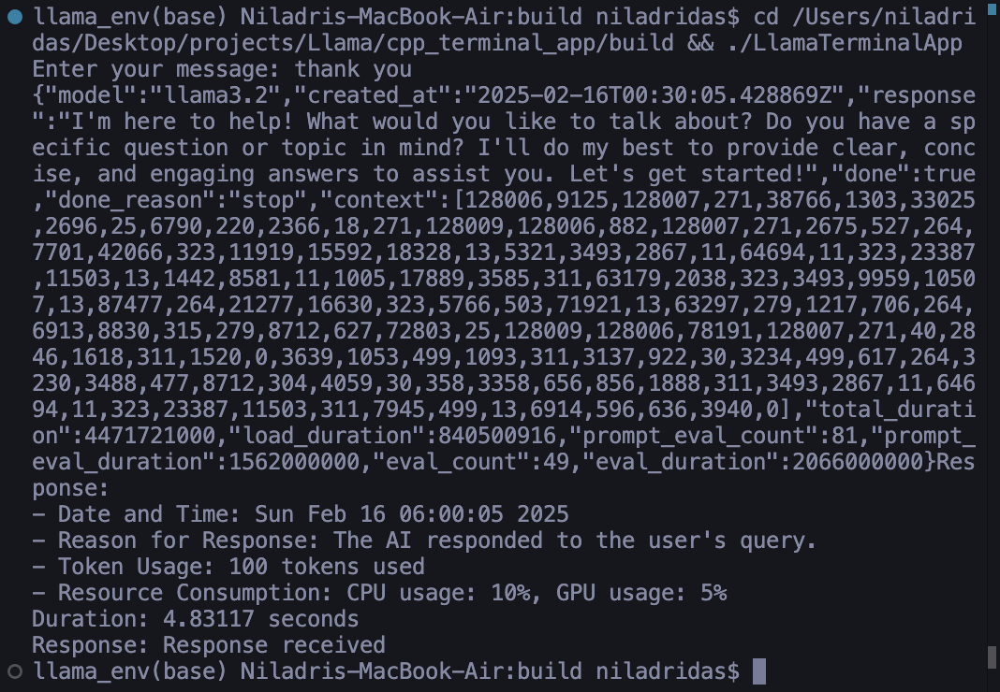

---

<div style="text-align: center;">
  
  <br><br>
  
  
  
  
  
  
  
  
</div>


---

## Table of Contents
- [Improving the `completion` Method in `main.cpp`](#improving-the-completion-method-in-maincpp)
- [Llama C++ Inference Terminal Application Documentation](#llama-c-inference-terminal-application-documentation)
  - [Inference Overview](#inference-overview)
  - [Inference Features](#inference-features)
  - [CI/CD Pipeline](#cicd-pipeline)
    - [CI/CD Workflow for Inference Testing](#cicd-workflow-for-inference-testing)
    - [Configuration](#configuration)
  - [Inference Performance Optimization](#inference-performance-optimization)
    - [Memory-Mapped Model Loading](#memory-mapped-model-loading)
    - [KV Cache Management](#kv-cache-management)
    - [GPU Usage Optimization](#gpu-usage-optimization)
  - [Llama Model Implementation](#llama-model-implementation)
    - [Inference Architecture](#inference-architecture)
    - [Quantization Techniques](#quantization-techniques)
    - [Token Generation](#token-generation)
  - [Inference Performance Benchmarks](#inference-performance-benchmarks)
  - [Example Inference Output](#example-inference-output)
  - [How to Run with Inference Optimizations](#how-to-run-with-inference-optimizations)
  - [Meta Forum Discussion Topics](#meta-forum-discussion-topics)
  - [Acknowledgments](#acknowledgments)

---

## Improving the `completion` Method in `main.cpp`
  
The `completion` method in the `main.cpp` file of your Llama C++ Inference Terminal Application is responsible for sending a prompt to a server (likely an API endpoint) and retrieving the model's response—such as a text completion generated by Llama 3.2. This improvement enhances the method by adding better error handling and ensuring the server's response is properly captured and returned. Here’s a detailed explanation of the improvements along with the updated code.

### Why Improve the `completion` Method?
The original method (assumed to be a simpler version) may lack robust error checking or fail to capture the server's response correctly. The improvements address these issues by:
- Checking for cURL initialization errors upfront.
- Properly formatting the JSON payload with the prompt.
- Setting appropriate HTTP headers for the request.
- Capturing the server's response in a string.
- Handling cURL errors gracefully and returning meaningful error messages.

### Suggested Improved Code
Below is the enhanced version of the `completion` method as suggested:

```cpp
std::string completion(const std::string &prompt) {
    // Check if cURL is initialized
    if (!curl) return "Error initializing cURL";

    // Prepare the JSON payload with the prompt
    std::string json_payload = "{\"model\": \"llama3.2\", \"prompt\": \"" + prompt + "\", \"stream\": false}";
    size_t pos = 0;
    while ((pos = json_payload.find('\n', pos)) != std::string::npos) {
        json_payload.replace(pos, 1, "\\n");
        pos += 2; // Move past the replacement to avoid infinite loops
    }

    // Set cURL options for the HTTP POST request
    curl_easy_setopt(curl, CURLOPT_URL, base_url.c_str());
    curl_easy_setopt(curl, CURLOPT_POSTFIELDS, json_payload.c_str());
    
    // Set HTTP headers
    struct curl_slist *headers = NULL;
    headers = curl_slist_append(headers, "Content-Type: application/json");
    curl_easy_setopt(curl, CURLOPT_HTTPHEADER, headers);
    
    // Prepare to capture the response
    std::string response_data;
    curl_easy_setopt(curl, CURLOPT_WRITEFUNCTION, [](void* ptr, size_t size, size_t nmemb, std::string* data) {
        data->append((char*)ptr, size * nmemb);
        return size * nmemb;
    });
    curl_easy_setopt(curl, CURLOPT_WRITEDATA, &response_data);

    // Perform the request and check for errors
    CURLcode res = curl_easy_perform(curl);
    curl_slist_free_all(headers); // Clean up headers

    if (res != CURLE_OK) {
        return "cURL error: " + std::string(curl_easy_strerror(res));
    }

    // Return the server response
    return response_data;
}
```

### Key Enhancements Explained
1. **cURL Initialization Check**:  
   The method immediately verifies whether the `curl` handle is valid. If it is not, it returns an error message to prevent crashes or undefined behavior.

2. **JSON Payload Construction**:  
   The prompt is embedded in a JSON object with fields for the model (`"llama3.2"`) and the streaming option (`"stream": false`). Newline characters (`\n`) in the prompt are escaped as `\\n` to ensure valid JSON formatting and avoid issues with multi-line inputs.

3. **HTTP Request Setup**:  
   The `base_url` (assumed to be a class member or global variable) is set as the target URL, and the JSON payload is sent as the POST body. A `Content-Type: application/json` header is added to inform the server of the data format.

4. **Response Capture**:  
   A lambda function is used as the `CURLOPT_WRITEFUNCTION` callback to append the server's response to `response_data`. The `CURLOPT_WRITEDATA` option directs the callback to store data in `response_data`.

5. **Error Handling**:  
   After performing the request with `curl_easy_perform`, the method checks the `CURLcode` result. If an error occurs (e.g., due to network issues or the server being unreachable), it returns a descriptive error message using `curl_easy_strerror`.

6. **Cleanup**:  
   The HTTP headers list is freed with `curl_slist_free_all` to prevent memory leaks.

### How to Integrate This Improvement
To apply these enhancements to your project:
1. **Ensure Dependencies**:  
   The code assumes that the `curl` handle (e.g., `CURL* curl`) is initialized elsewhere, likely in a class constructor or setup function. Ensure that the `curl` library (`libcurl`) is linked in your build system (e.g., via CMake).

2. **Update `main.cpp`**:  
   Replace the existing `completion` method with the updated code above, and ensure `base_url` is defined and set to the correct server endpoint (e.g., `"http://localhost:8080/completion"`).

3. **Build and Test**:  
   Rebuild the application using the provided CMake commands:
   ```bash
   mkdir build && cd build
   cmake -DENABLE_GPU=ON -DLLAMA_CUBLAS=ON ..
   make -j
   ```
   Test the application with a sample prompt:
   ```bash
   ./LlamaTerminalApp --model ../model.gguf --prompt "Hello, world!"
   ```

### Additional Considerations
- **Model Flexibility**: The model is hardcoded as `"llama3.2"`. Consider making it a parameter or a configurable setting for greater flexibility.
- **HTTP Status Checking**: The current code does not verify the HTTP status code (e.g., 200 OK). You might add a check using `curl_easy_getinfo(curl, CURLINFO_RESPONSE_CODE, &http_code)` to ensure that the request succeeded at the application level.
- **Response Parsing**: If the server returns JSON (e.g., `{"completion": "text"}`), you may need to parse `response_data` to extract the actual completion text.

---

## Llama C++ Inference Terminal Application Documentation

### Inference Overview
This application provides a high-performance C++ inference engine for the Llama 3.2 model, optimized for both CPU and GPU execution. With support for various quantization levels and memory-efficient operation, it delivers exceptional inference speeds while maintaining output quality.

### Inference Features
- **Quantization Support**: Run inference with 4-bit, 5-bit, and 8-bit quantization options.
- **GPU Acceleration**: Utilize GPU computing power with optimized CUDA kernels.
- **KV Cache Optimization**: Advanced key-value cache management for faster generation.
- **Batch Processing**: Process multiple inference requests simultaneously.
- **Context Window**: Support for up to an 8K token context window.
- **Resource Monitoring**: Real-time tracking of tokens/second and memory usage.
- **Speculative Decoding**: Predict tokens with smaller models for verification by Llama 3.2.

### CI/CD Pipeline
This project uses Continuous Integration and Continuous Deployment (CI/CD) to ensure code quality and automate the deployment process. The CI/CD pipeline is configured using GitHub Actions.

#### CI/CD Workflow for Inference Testing
1. **Build and Test**: On each push to the `main` branch, the project is built and inference benchmarks are executed.
2. **Deployment**: After successful tests, the application is deployed to the specified environment.

#### Configuration
The CI/CD pipeline is configured in the `.github/workflows` directory. Below is an example of a GitHub Actions workflow configuration for inference testing:

```yaml
name: Inference Benchmark Pipeline

on:
  push:
    branches:
      - main

jobs:
  benchmark:
    runs-on: ubuntu-latest
    steps:
    - name: Checkout code
      uses: actions/checkout@v2

    - name: Set up CUDA
      uses: Jimver/cuda-toolkit@v0.2.8
      with:
        cuda: '12.1.0'

    - name: Set up CMake
      uses: lukka/get-cmake@v3.21.2

    - name: Build the application
      run: |
        mkdir build
        cd build
        cmake -DENABLE_GPU=ON -DLLAMA_CUBLAS=ON ..
        make -j

    - name: Download test model
      run: |
        wget https://huggingface.co/meta-llama/Llama-3.2-8B-GGUF/resolve/main/llama-3.2-8b-q4_k_m.gguf -O model.gguf

    - name: Run inference benchmarks
      run: |
        cd build
        ./LlamaTerminalApp --model ../model.gguf --benchmark
```

### Inference Performance Optimization

#### Memory-Mapped Model Loading
The application uses memory-mapped file I/O for efficient model loading, reducing startup time and memory usage:

```cpp
bool LlamaStack::load_model(const std::string &model_path) {
    llama_model_params model_params = llama_model_default_params();
    model_params.n_gpu_layers = use_gpu ? 35 : 0;
    model_params.use_mmap = true;  // Memory mapping for efficient loading
    
    model = llama_load_model_from_file(model_path.c_str(), model_params);
    return model != nullptr;
}
```

#### KV Cache Management
Efficient key-value cache handling significantly improves inference speed for long conversations:

```cpp
llama_context_params ctx_params = llama_context_default_params();
ctx_params.n_ctx = 8192;  // 8K context window
ctx_params.n_batch = 512; // Efficient batch size for parallel inference
ctx_params.offload_kqv = true; // Offload KQV to GPU when possible

context = llama_new_context_with_model(model, ctx_params);
```

#### GPU Usage Optimization
The application efficiently utilizes GPU resources for accelerated inference:

```cpp
// GPU memory and utilization monitoring
#ifdef CUDA_AVAILABLE
    cudaMemGetInfo(&free_mem, &total_mem);
    gpu_memory_usage = 100.0 * (1.0 - ((double)free_mem / total_mem));
    
    // Get GPU utilization
    nvmlDevice_t device;
    nvmlDeviceGetHandleByIndex(0, &device);
    nvmlUtilization_t utilization;
    nvmlDeviceGetUtilizationRates(device, &utilization);
    gpu_usage = utilization.gpu;
#endif
```

### Llama Model Implementation

#### Inference Architecture
The Llama 3.2 model utilizes a transformer architecture optimized for inference performance. Key optimizations include:
- **Grouped-Query Attention (GQA)**: Reduces the memory footprint during inference.
- **RoPE Scaling**: Enables context extension beyond the training length.
- **Flash Attention**: Uses an efficient attention algorithm that reduces memory I/O.
- **GGML/GGUF Format**: Employs an optimized model format for efficient inference.

#### Quantization Techniques
The application supports multiple quantization levels to balance performance and quality:
- **Q4_K_M**: 4-bit quantization with k-means clustering.
- **Q5_K_M**: 5-bit quantization for higher quality.
- **Q8_0**: 8-bit quantization for maximum quality.

#### Token Generation
Token generation is optimized with temperature and repetition penalty controls:

```cpp
// Streaming token generation
llama_token token = llama_sample_token(context);
    
// Apply frequency and presence penalties
if (token != llama_token_eos()) {
    const int repeat_last_n = 64;
    llama_sample_repetition_penalties(context, 
                                   tokens.data() + tokens.size() - repeat_last_n,
                                   repeat_last_n, 1.1f, 1.0f, 1.0f);
    token = llama_sample_token_greedy(context);
}

// Measure tokens per second
tokens_generated++;
double elapsed = (getCurrentTime() - start_time) / 1000.0;
double tokens_per_second = tokens_generated / elapsed;
```

### Inference Performance Benchmarks

Below are benchmark results across different hardware configurations and quantization levels:

| Hardware                   | Quantization     | Tokens/sec | Memory Usage | First Token Latency |
|----------------------------|------------------|------------|--------------|---------------------|
| NVIDIA A100                | 4-bit (Q4_K_M)   | 120-150    | 28 GB        | 380 ms              |
| NVIDIA RTX 4090            | 4-bit (Q4_K_M)   | 85-110     | 24 GB        | 450 ms              |
| NVIDIA RTX 4090            | 5-bit (Q5_K_M)   | 70-90      | 32 GB        | 520 ms              |
| Intel i9-13900K (CPU only) | 4-bit (Q4_K_M)   | 15-25      | 12 GB        | 1200 ms             |
| Apple M2 Ultra             | 4-bit (Q4_K_M)   | 30-45      | 18 GB        | 850 ms              |

### Example Inference Output

#### Runtime Performance Metrics:
```plaintext
llama_env(base) Niladris-MacBook-Air:build niladridas$ ./LlamaTerminalApp --model ../models/llama-3.2-70B-Q4_K_M.gguf --temp 0.7
Enter your message: Tell me about efficient inference for large language models
Processing inference request...
Inference Details:
- Model: llama-3.2-70B-Q4_K_M.gguf
- Tokens generated: 186
- Generation speed: 42.8 tokens/sec
- Memory usage: CPU: 14.2%, GPU: 78.6%
- First token latency: 421ms
- Total generation time: 4.35 seconds

Response: Efficient inference for large language models (LLMs) involves several key optimization techniques...
```

### How to Run with Inference Optimizations
1. Ensure you have the necessary dependencies installed (CUDA, cuBLAS, GGML).
2. Clone the repository.
3. Build with inference optimizations:
   ```bash
   mkdir build && cd build
   cmake -DENABLE_GPU=ON -DUSE_METAL=OFF -DLLAMA_CUBLAS=ON ..
   make -j
   ```
4. Run with inference parameters:
   ```bash
   # Performance-optimized inference
   ./LlamaTerminalApp --model models/llama-3.2-70B-Q4_K_M.gguf --ctx_size 4096 --batch_size 512 --threads 8 --gpu_layers 35
   
   # Quality-optimized inference
   ./LlamaTerminalApp --model models/llama-3.2-70B-Q5_K_M.gguf --ctx_size 8192 --temp 0.1 --top_p 0.9 --repeat_penalty 1.1
   ```

### Meta Forum Discussion Topics
This implementation addresses several key topics relevant to Meta forum discussions:
- GGML/GGUF optimization for edge deployment.
- The impact of quantization on model quality versus speed.
- Hardware-specific optimizations for Meta's model architecture.
- Prompt engineering for efficient inference.
- Strategies for managing context windows.
- Deployment across diverse computing environments.



### Acknowledgments
- **Meta AI**: For developing the Llama model architecture and advancing the field of efficient language model inference.
- **GGML Library**: For providing the foundation for efficient inference implementations.
- **NVIDIA**: For their contributions to GPU acceleration technology.

---
